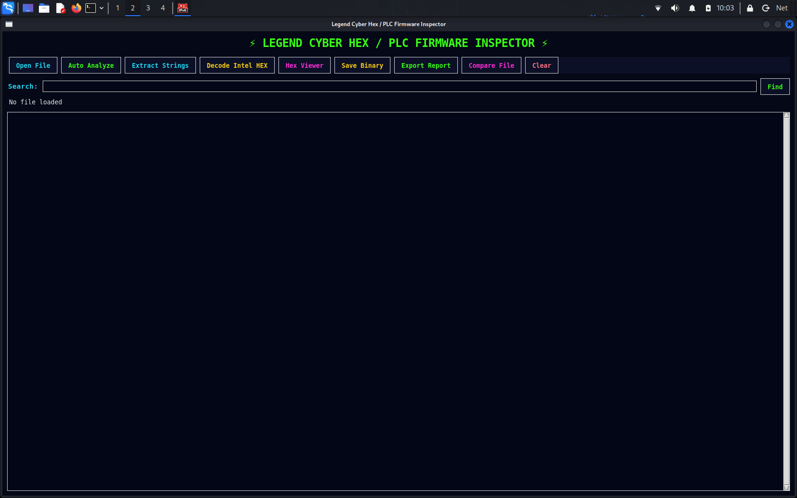
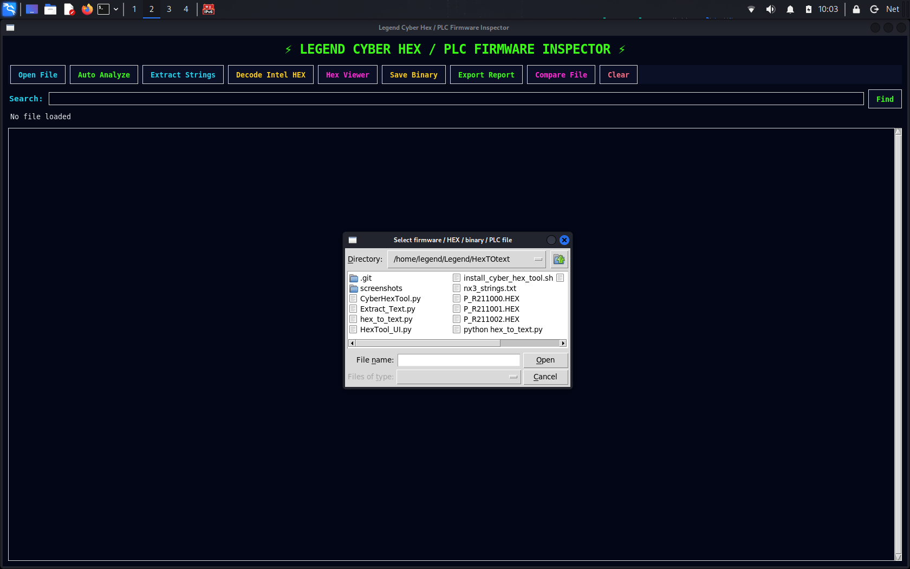
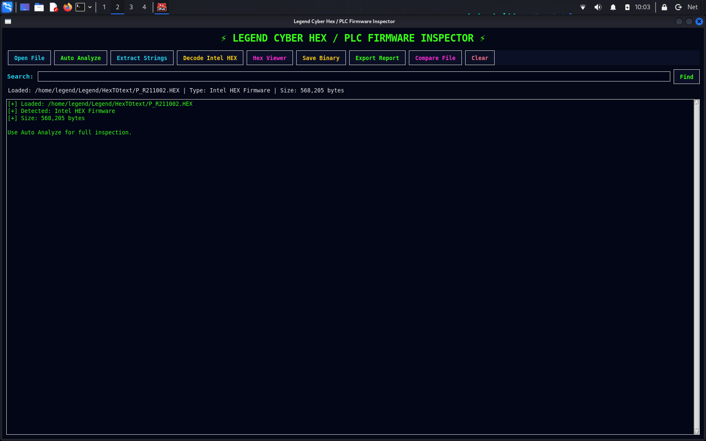
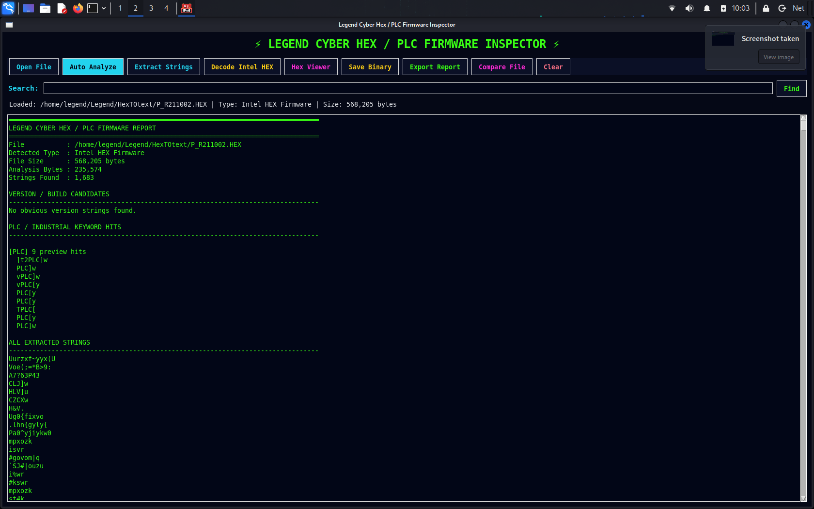
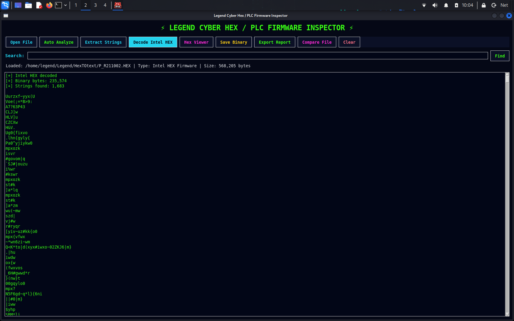
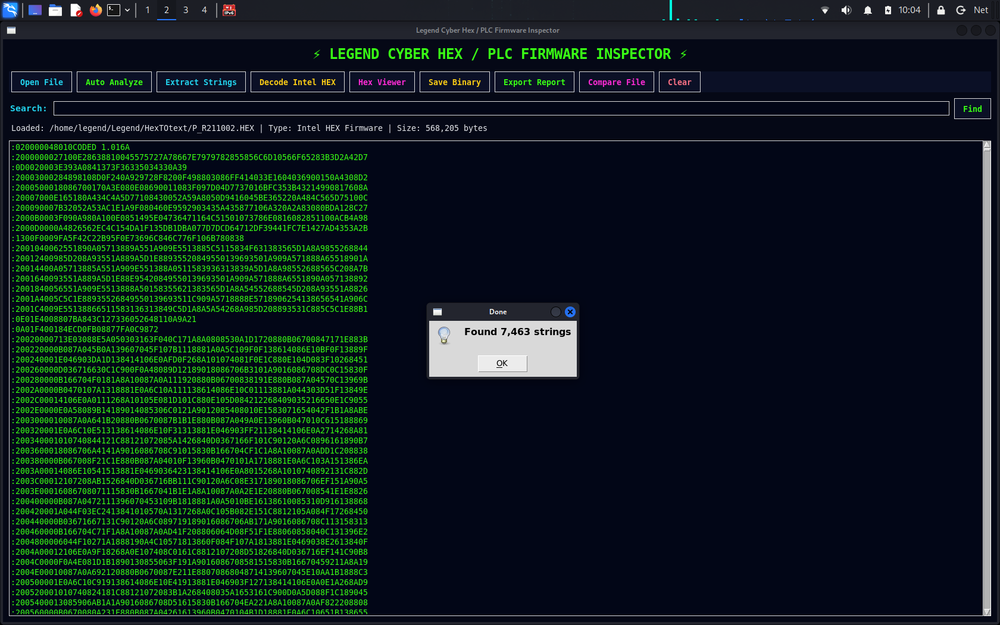
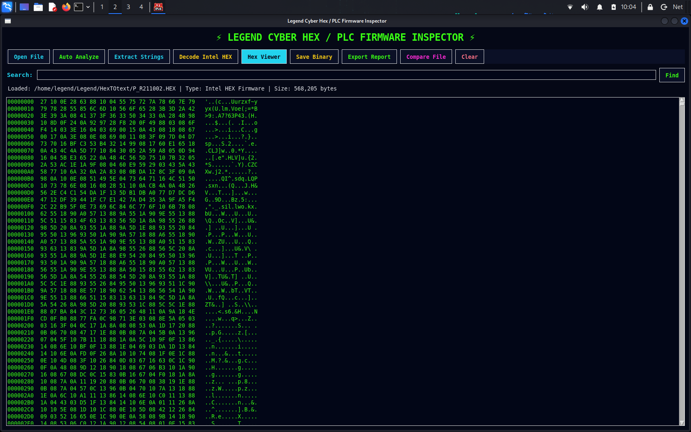
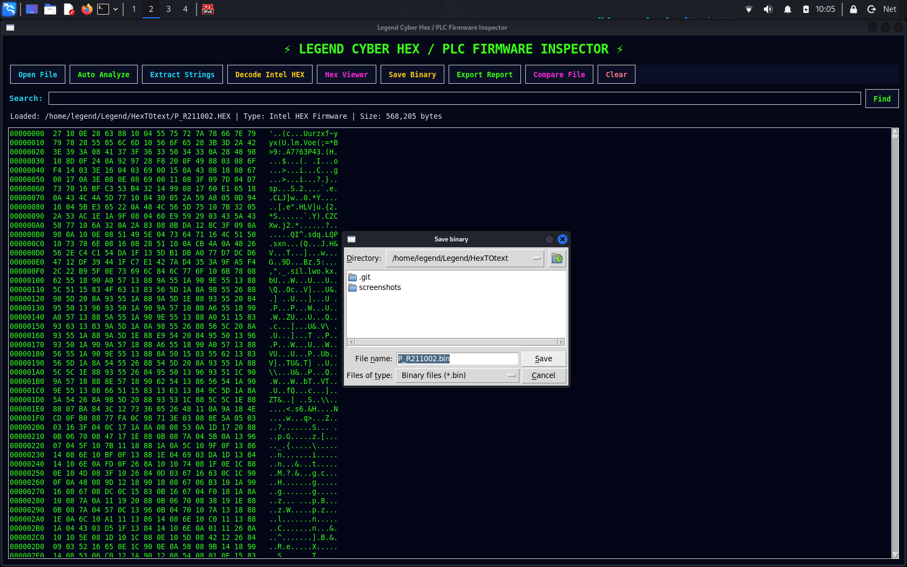
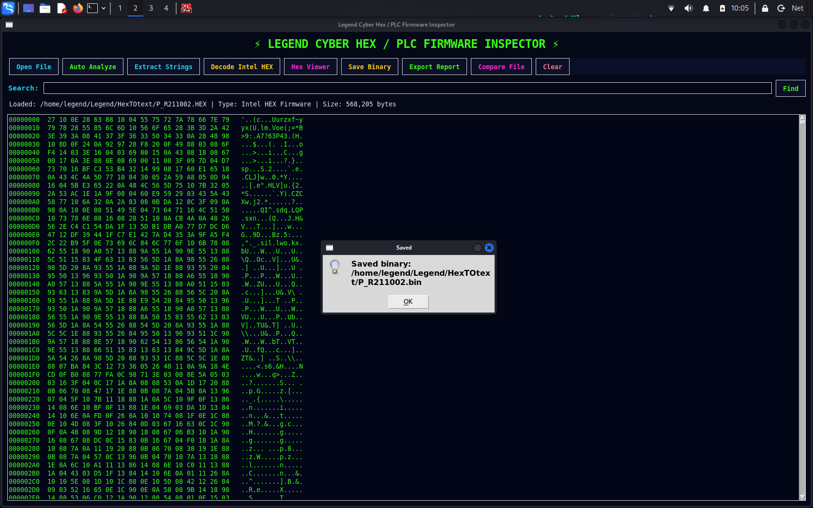

# Legend-HexToText

<p align="center">
  <strong>Legend Cyber Hex / PLC Firmware Inspector</strong><br>
  Industrial hex, binary, firmware, PLC/HMI inspection, and text-extraction toolkit.
</p>

<p align="center">
  <code>Python</code> · <code>Intel HEX</code> · <code>Binary Analysis</code> ·
  <code>PLC/HMI</code> · <code>Reverse Engineering</code>
</p>

---

## Overview

**Legend-HexToText** is a cyber-themed local Python application for inspecting and comparing industrial firmware and binary artifacts.

It supports workflows involving:

- Intel HEX firmware
- Raw binary files
- PLC/HMI artifacts
- TwinCAT and Siemens configuration exports
- Embedded firmware files
- Extracted strings, versions, build identifiers, and PLC-related keywords

The application runs locally and provides a graphical interface for loading files, decoding data, extracting readable strings, viewing hexadecimal content, comparing files, saving decoded binaries, and exporting reports.

> **Authorization notice:** Only inspect firmware, configuration files, binaries, and industrial artifacts that you own or are explicitly authorized to analyze.

---

## Features

- Automatic file-type detection
- Intel HEX decoding
- Raw binary inspection
- ASCII string extraction
- PLC keyword scanning
- Version and build identifier detection
- Searchable output panel
- Hexadecimal viewer
- Decoded binary export
- Full analysis-report export
- Side-by-side file comparison
- Local cyber-themed graphical interface

---

## Screenshots

### Main window



### Open and load a file





### Automatic analysis



### Decode Intel HEX data



### Extract readable strings



### Hex viewer



### Compare files


### Save decoded binary





### Export report


---

## Requirements

- Python 3
- Tkinter-compatible desktop environment
- Linux, Windows, or another operating system capable of running the Python UI

On Debian-based Linux distributions, Tkinter can be installed with:

```bash
sudo apt update
sudo apt install python3-tk
```

---

## Installation

### Clone the repository

```bash
git clone https://github.com/DK4Never/Legend-HexToText.git
cd Legend-HexToText
```

### Run the main application

```bash
chmod +x CyberHexTool.py
python3 CyberHexTool.py
```

### Run the installer script

```bash
chmod +x install_cyber_hex_tool.sh
./install_cyber_hex_tool.sh
```

---

## Basic workflow

1. Launch `CyberHexTool.py`.
2. Open an authorized Intel HEX, binary, PLC/HMI, or firmware artifact.
3. Run automatic analysis or decode the selected file.
4. Review extracted strings, keywords, version information, and hexadecimal data.
5. Search the output for relevant values.
6. Compare a second file when investigating firmware revisions.
7. Save the decoded binary or export the complete analysis report.

---

## Repository structure

```text
Legend-HexToText/
├── CyberHexTool.py
├── Extract_Text.py
├── HexTool_UI.py
├── hex_to_text.py
├── install_cyber_hex_tool.sh
├── README.md
├── LICENSE
├── .gitignore
├── screenshots/
│   ├── Auto_Analyze.png
│   ├── Compare_Files.png
│   ├── Decode.png
│   ├── Export_Report.png
│   ├── Extracted_Strings.png
│   ├── Hex_Viewer.png
│   ├── Loaded_File.png
│   ├── Main_Window.png
│   ├── Open_Main.png
│   ├── Save_Binary.png
│   └── Saved.png
└── sample or authorized analysis files
```

---

## Command-line utilities

The repository also includes supporting Python utilities for hex-to-text conversion and text extraction:

```bash
python3 hex_to_text.py
python3 Extract_Text.py
```

Behavior and accepted arguments depend on the utility implementation. Review the script source or run it in a controlled test directory before processing important files.

---

## Planned improvements

- Firmware-difference visualization
- Memory-map visualization
- Motorola S-record support
- ELF and PE inspection
- Entropy analysis
- Binary-pattern search
- Signature-based identification
- Improved report formatting
- Plugin architecture
- Expanded automated tests

---

## Security and responsible use

This project is intended for legitimate engineering, maintenance, interoperability, recovery, defensive research, and authorized reverse-engineering workflows.

Do not use it to inspect, copy, modify, or distribute proprietary firmware or machine data without permission.

---

## License

Released under the [MIT License](LICENSE).

---

## Author

**Dean Kruger**  
Senior Software Engineer · Systems Architect · DevOps Engineer

- GitHub: [DK4Never](https://github.com/DK4Never)
- Portfolio: [dk4never.github.io](https://dk4never.github.io)

---

<p align="center">
  <em>Engineering practical tools for industrial automation, firmware analysis, and cybersecurity.</em>
</p>
